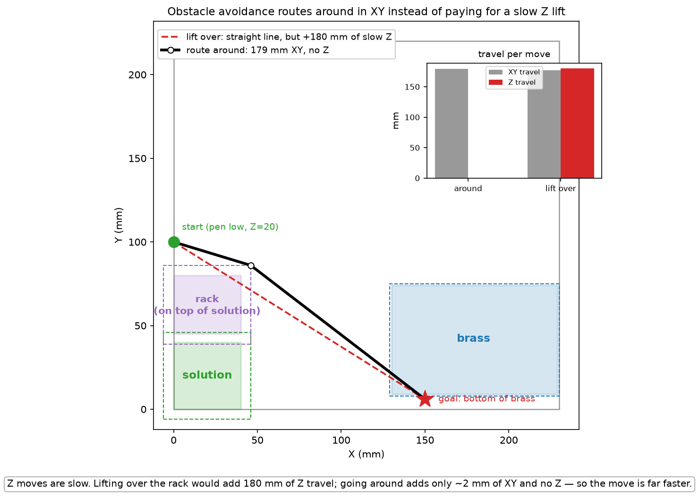
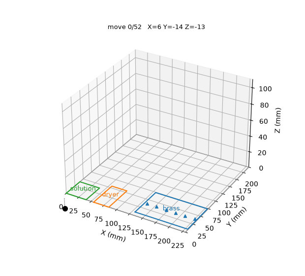

# board_stage

Generic Ender 3 XY(Z) positioning library: raw motion, board-frame calibration, and obstacle-avoiding routing between named board objects.

> Concept-first guide: [`docs/`](docs/README.md). This README is just install and a quick taste.



*To reach the bottom of `brass`, the pen must get past `solution` and the rack on
top of it. Lifting over the rack would add 180 mm of slow Z travel; the
visibility-graph planner (`find_path`) instead routes around it in XY for ~2 mm
more travel and no Z. See [Path finding](docs/path-finding.md).*

## Installation

```bash
pip install -e .              # core
pip install -e ".[plot]"      # + matplotlib visualization
pip install -e ".[dev]"       # + ruff
```

Or with `uv`: `uv add --path ../board-stage board-stage`.

## Quickstart

Describe the board once, then drive the pen to named objects. Action points are
local to each object and translated to the board frame for you.

```python
from board_stage import (
    Board,
    BoardConfig,
    BoardObject,
    BoardPoint,
    Ender3_printer,
    GridAction,
    Pen,
    PrinterPoint,
    SinglePointAction,
    setup_board,
)

board_config = BoardConfig(
    pen=Pen(width=2.0),
    objects={
        "solution": BoardObject(
            id="solution",
            x=0.0, y=0.0, width=40.0, height=40.0,
            safe_z=55.0, margin=5.0,
            default_action=SinglePointAction(point=BoardPoint(x=25.0, y=25.0, z=23.0)),
        ),
        "brass": BoardObject(
            id="brass",
            x=130.0, y=9.0, width=99.0, height=65.0, safe_z=10.0,
            actions=[GridAction(start=BoardPoint(x=5.0, y=30.0), end=BoardPoint(x=95.0, y=30.0), steps=10, z=1.0)],
        ),
    },
)

printer = Ender3_printer("/dev/ttyUSB0", origin=PrinterPoint(6.0, -14.0, 13.0))

with Board(printer, board_config) as board:
    setup_board(board)  # force_calibrate=True to home first
    board.park()

    with board.at("solution"):
        pass  # dips in, then retracts on exit

    for point in board.action_points("brass"):
        with board.at("brass", point):
            ...  # run your measurement here

    board.park()
```

`board.at(...)` raises to a safe Z, routes around other objects, descends onto
the target, and retracts when the block exits. With no target it uses the
object's `default_action`; pass `point=`, `coords=(x, y)`, or `descend=False`.

## Dry run



*The same cycle replayed with no printer attached — `dry_run` records every move
and `animate` plays it back in 3D. See [Simulation](docs/simulation.md).*

## Path finding

While the pen travels below an object's `safe_z`, that object's inflated
footprint becomes a keep-out zone and the move is rerouted around it with a
visibility graph + Dijkstra (`find_path`). Above `safe_z`, moves are straight
lines. The `Board` does this for you; `find_path` is public if you want it
directly. More in [Path finding](docs/path-finding.md).

## Documentation

| Doc | Covers |
| --- | --- |
| [Core concepts](docs/concepts.md) | frames, board objects, actions, keep-out zones |
| [Path finding](docs/path-finding.md) | keep-out zones, visibility graph + Dijkstra |
| [Using the board](docs/workflow.md) | calibration, `at(...)`, routing |
| [Simulation](docs/simulation.md) | `dry_run` and visualization |

Runnable example: [`examples/measurement_cycle.py`](examples/measurement_cycle.py).

## Development

```bash
ruff format .
ruff check .
```

## Public API

```python
from board_stage import (
    Printer,
    Ender3_printer,
    BasePoint,
    BoardPoint,
    PrinterPoint,
    AnyPoint,
    Point,
    Board,
    setup_board,
    Action,
    ActionPoint,
    SinglePointAction,
    CenterAction,
    GridAction,
    BoardConfig,
    BoardObject,
    Pen,
    Rect,
    find_path,
    NullPrinter,
    dry_run,
)
```
