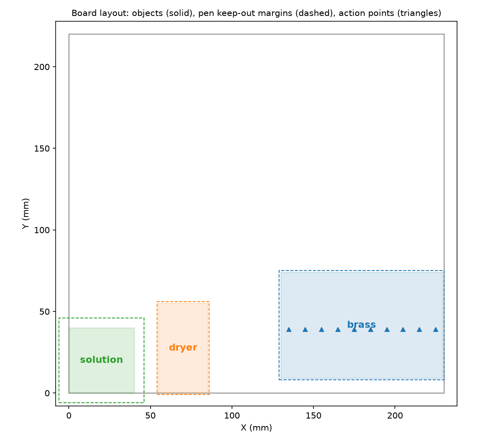

# Core concepts

## Coordinate frames

Points are tagged with the frame they belong to, so a mix-up fails loudly:

| Type | Frame |
| --- | --- |
| `BoardPoint` | Board (millimetres from the board's bottom-left corner; `Z = 0` touches the surface) |
| `PrinterPoint` | The Ender's own machine coordinates |

Adding or subtracting points from different frames raises a `TypeError`. `Point`
is a backwards-compatible alias for `BoardPoint`.

The Printer's `origin` (a `PrinterPoint`) bridges the two. It is the pen's
starting reference: it says where the board's `(0, 0)` sits in machine
coordinates, and which machine Z touches the board. You work in the board frame
only — the `Board` converts when it sends G-code.

## Board objects

A `BoardObject` is a named rectangle on the bed – a sample, a tube, a wash
station. Positions are in the board frame.



*Three objects with their keep-out margins (dashed) and action points (triangles).*

| Field | Meaning |
| --- | --- |
| `id` | Name, also the key in `BoardConfig.objects` |
| `x`, `y` | Distance from the board's bottom-left corner to the object's bottom-left corner |
| `width`, `height` | Size of the rectangle (must be > 0) |
| `safe_z` | Z at or above which the pen can safely pass over the object |
| `margin` | Extra clearance added around the footprint |
| `default_action` | Where to go when no specific point is given |
| `actions` | The list of points to visit (see below) |

`x` and `y` are **measured distances on the physical board**: from the
bottom-left corner of the board (where the pen starts) to the bottom-left corner
of the object. The pen's own starting offset is folded into the `origin`, so you
measure the distance and enter that number directly, without adding any offset
yourself.

Each object also has a **local frame**: `(0, 0)` is the object's bottom-left
corner. Action points are written in local coordinates and must stay inside the
rectangle; the library checks this when the object is created.

## Actions in depth

An `Action` is a reusable recipe that produces one or more points **inside an
object, in local coordinates** (`(0, 0)` = the object's bottom-left corner, `z` =
height above the board surface). Attach them with `actions=[...]`; the
`default_action` is the fallback used when no specific point is requested.

Every action implements `resolve(obj) -> Sequence[BoardPoint]`. The object then
turns each returned point into a resolved `ActionPoint` (see below). The built-in
actions:

| Action | `resolve` returns | Use for |
| --- | --- | --- |
| `SinglePointAction(point=BoardPoint(...))` | That one point | A fixed spot (a dip, a reference) |
| `CenterAction(z=...)` | `(width/2, height/2, z)` | "Go to the middle of the object" |
| `GridAction(start=..., end=..., steps=..., z=...)` | `steps` points evenly spaced from `start` to `end`, inclusive, all at height `z` | Scanning a line of measurement spots |

Details worth knowing:

- **`SinglePointAction`** carries its own `z` on the point; nothing is recomputed.
- **`CenterAction`** computes the centre from `width`/`height`, so it tracks the
  object if you move or resize it. `z` is required.
- **`GridAction`** takes `start`/`end` as local `BoardPoint`s but only uses their
  `x`/`y`; every generated point sits at `z`. Both endpoints are included, and
  `steps=1` returns just `start`. `steps` must be `>= 1`.
- **Custom actions** just subclass `Action` and implement `resolve`; return any
  number of local points:

  ```python
  class DiagonalAction(Action):
      def resolve(self, obj):
          return [BoardPoint(x=0, y=0, z=1), BoardPoint(x=obj.width, y=obj.height, z=1)]
  ```

## Action points

`obj.action_points` (or `board.action_points(object_id)`) resolves `actions` **in
order**, so the list is also the visit order. Each `ActionPoint` carries both
frames plus its provenance:

```python
point = board.action_points("brass")[0]
point.object_id   # 'brass'
point.index       # 0 — position in visit order
point.action      # the Action that produced it
point.local       # (5.0, 30.0, 1.0)   object-relative
point.board       # (135.0, 39.0, 1.0) absolute
```

- The `default_action` is **not** included in `action_points`; it is the fallback
  target, available separately as `default_action_point`.
- Local points are validated at construction to satisfy `0 <= x <= width` and
  `0 <= y <= height`, so a typo fails before anything moves.
- `local_action_points` and `board_action_points` give just the coordinates.
- Visit them with `board.at(object_id, point)`.

## The pen and keep-out zones

The pen is the tool mounted on the printer's moving part — the head/gantry — so
wherever the printer moves, the pen goes with it. `Pen(width=...)` is the tool's
diameter: because the head sweeps a disc of that width, each object's keep-out
footprint is its rectangle grown by `margin + pen.width / 2`:

```python
obj.get_rect(pen)  # -> Rect, inflated for clearance
```

While the pen travels **below** an object's `safe_z`, that object's footprint is
treated as an obstacle and the route is planned around it. At or above
`safe_z`, the pen simply travels in a straight line over the object. This is why
every object needs a realistic `safe_z`: too low and you crash, too high and
every move is a long detour.
